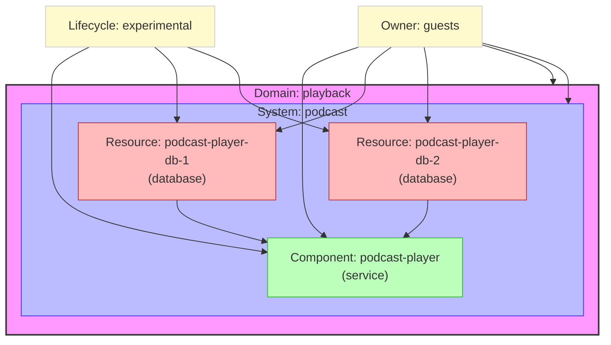

# Podcast System Architecture

This diagram visually represents the architecture described in your podcast.yaml file, showing:
- A Domain (playback) containing 
- A System (podcast) containing
- A Component (podcast-player) with 
- Two database resources (podcast-player-db-1 and podcast-player-db-2) that the component depends on
- All entities share the same owner (guests)
- Component and resources have experimental lifecycle status
